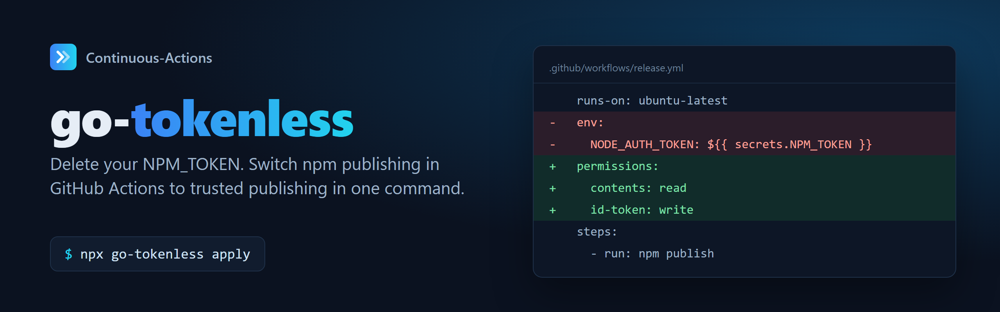

# Migrate npm publishing to trusted publishing (OIDC)

From **January 2027**, a granular npm token that bypasses 2FA can no longer publish on its own ([npm docs](https://docs.npmjs.com/about-access-tokens/)). The replacement for CI is [trusted publishing](https://docs.npmjs.com/trusted-publishers): GitHub signs a short-lived OIDC token for the workflow run, npm exchanges it for a publish token, and no secret is stored anywhere.

## Do it in one command

```bash
npx go-tokenless          # preview: lists every change and shows a diff, writes nothing
npx go-tokenless apply    # makes the changes and prints the npm trust commands
```

[go-tokenless](https://github.com/continuous-actions/go-tokenless) (MIT) edits only the lines that need changing. It refuses unsafe cases instead of guessing:

- self-hosted runners
- publish jobs reachable from `pull_request_target` or `issue_comment`
- `repository` pointing at another repo

## The checklist it applies

1. **OIDC permission:** the publishing job has `permissions: id-token: write`.
2. **npm version:** npm **11.5.1 or newer** runs the publish. Node 24 ships it; on Node 22, add `npm install -g npm@^12` first.
3. **No token:** no `NODE_AUTH_TOKEN` / `NPM_TOKEN` reaches the publish step. npm falls back to a configured token.
4. **Registry:** `actions/setup-node` has `registry-url: https://registry.npmjs.org`.
5. **Repository field:** `package.json` `repository.url` names this GitHub repo.
6. **Trusted publisher:** one exists on npm for each package, naming the exact workflow file:
   `npm trust github <pkg> --repo OWNER/REPO --file release.yml --allow-publish --yes`
7. **Old secret:** deleted after the first tokenless release.

## Fix a failing publish

- [`npm error code ENEEDAUTH`](errors/eneedauth.html)
- [`npm error 404 Not Found - PUT https://registry.npmjs.org/...`](errors/e404-put.html)
- [`npm error code E422` … `repository.url`](errors/e422-repository-url.html)
- [Publishing still uses `NPM_TOKEN` after the migration](errors/still-uses-token.html)
- [`npm notice npm tokens that bypass 2FA are being restricted`](errors/bypass-2fa-notice.html)

## Use it from an AI coding agent

```bash
claude mcp add go-tokenless -- npx -y go-tokenless mcp
```

It's also a Claude Code plugin, a Gemini CLI extension and an Agent Skill. See the [README](https://github.com/continuous-actions/go-tokenless#use-it-with-ai-agents).
